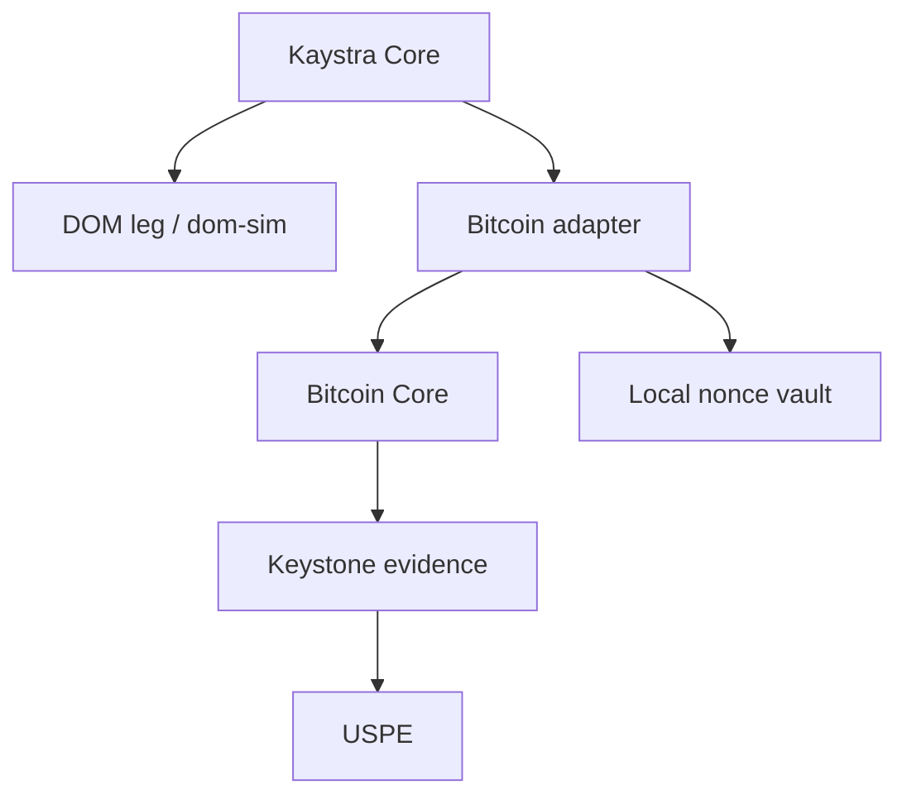

> **D-027 reconciliation note (v3.3)**
>
> **Status:** adopted as the F5 EXECUTION SPECIFICATION by D-012 and revised
> by sovereign operator decision D-027 on 2026-08-12. D-027 requires regtest
> plus custom Signet BIP-325 only. Public Signet is optional and outside the
> F5-F8 gates, roadmap and release. Mainnet remains excluded.
>
> **v3.3 delta over v3.2:** D-014 is preserved as SUPERSEDED history and
> replaced in full by D-027; the reproducible custom Signet is made the sole
> Signet gate environment; the former Public-Signet gate operand and every
> active Public-Signet obligation are removed; the official Core miner,
> non-trivial P2PK challenge,
> split topology, network pins, conformance-only CSV and evidence manifest are
> normative. Foundation v0.17 is the current base authority.

DOM Interop — Annex M v3.3

Integral Engineering Specification of the Bitcoin Leg

```text
Base document:        DOM-Interop-Foundation-Document-v0.17.md
Operational record:   DOM-Interop-Anexo-M-v3.1-Bitcoin-OPERACIONAL.md
Annex version:        3.3
Date:                 2026-08-12
State:                ADOPTED F5 EXECUTION SPECIFICATION (D-012/D-027)
Authority:            Soren Planck, operator and ratification authority
Execution scope:      F5 — Bitcoin leg
Associated gate:      G-F5
Normative language:   English
```

This annex fully consolidates the Bitcoin leg of DOM Interop. It contains
the architecture, the formats, the APIs, the state machines, the invariants,
the persistence, the bidirectional flows, the conformance tests and the
adjudication rule of Phase 5.

This document was created by express order of the operator on 2026-08-09 to
preserve the previously closed technical decisions. The order authorizes
document production, but does not authorize implementation, commit, push,
ratification or gate change.

────────

M.0. Authority, outcome and taxonomy

M.0.1. Applicable hierarchy

In case of conflict, the following prevail, in this order:

1. Bitcoin consensus and formats in force in the BIPs cited in this annex;
2. code at the pinned commit of secp256k1-zkp after D-013;
3. code at the pinned rev of dom-adaptor for the DOM leg;
4. decisions formally ratified in the Foundation Document;
5. the Foundation Document in force;
6. this annex while [PROPOSAL];
7. the Persistent Operational Record of 2026-08-08;
8. earlier documents and conversations, as history only.

Foundation Document v0.17 is the base of this revision. D-014 remains
preserved as SUPERSEDED history; D-027 is the active network authority.

M.0.2. Expected terminal outcome

When F5 has been authorized, implemented, audited and adjudicated, the system
must simultaneously prove:

• a Bitcoin P2TR output with claim via key-path MuSig2/adaptor BIP340;
• refund via script-path with CSV actually validated by Bitcoin Core;
• two real participants, with no unilateral spend on the claim path;
• aggregate key and Taproot output indistinguishable from ordinary P2TR keys;
• SIGHASH_DEFAULT over a frozen claim transaction;
• adaptation and exact extraction of t, with all parities handled;
• one-shot nonce, persist-before-exposure and safe abort after crash;
• reorg-aware Bitcoin observation, via a durable cursor;
• Keystone evidence that is verifiable and consumed by the USPE;
• E2E DOM(dom-sim) ↔ BTC on regtest and signet, in both directions;
• no change to DOM Core, DOM Scriptless Contracts, DOM Wallet,
Bitcoin consensus or DOM consensus.



Kaystra coordinates outcomes; it does not sign. The Bitcoin adapter interprets
only the Bitcoin chain. Keystone produces evidence, but holds no funding or
signing authority. The vault lives at the boundary of the local signer.

M.0.3. Exact preserved state

```text
ANNEX M v3.3 ............................. ADOPTED (D-012/D-027)
A8a  Parity and canonical extraction ..... RATIFIED (D-013)
A8b  MuSig2 + TapTweak + witness ......... RATIFIED (D-013)
A9   Test networks ....................... RATIFIED (D-027)
C1a/C1b/C2/C3/C4 ......................... IMPLEMENTED; execution required
F5 ....................................... COMPLETE only under M.15.1
G-F5 ..................................... PASS only under M.15.2
Technical reservations in the text ....... none
```

SPECIFIED, RATIFIED, IMPLEMENTED, EXECUTED and PASS are distinct states. No
executor may promote a state by inference.

M.0.4. Non-negotiable limits

This annex does not:

• turn DOM Interop into a BTC↔third-party bridge without the DOM;
• make Keystone a custodian, signer, privileged coordinator or funding
authority;
• introduce an admin key, guardian, global pause or unilateral upgrade;
• reimplement BIP340, BIP327, Taproot or secp256k1 primitives in production;
• allow Relay, store, USPE or Keystone to store t, secret nonces,
private shares, seeds or private keys;
• allow Bitcoin mainnet during F5;
• use dom-sim as proof of the real DOM; that still belongs to F7;
• substitute for D-013 or D-027.

────────

M.1. Notation, primitives and key aggregation

M.1.1. Cryptographic notation

```text
G       generator of secp256k1
n       order of the secp256k1 group
d_i     secret share/key of participant i; never leaves the local signer
P_i     compressed public key of participant i
P       MuSig2 aggregate public key before the TapTweak
P_x     x-only representation of P with lift_x of even y
h       TapTweak = tagged_hash("TapTweak", x(P) || merkle_root)
Q       Taproot output key, Q = P + h·G
g_Q     sign/parity needed to sign under Q
t       adaptor secret, canonical scalar 1..n-1
T       adaptor point, T = t·G
R_pre   aggregate nonce prior to applying the adaptor
R       effective BIP340 nonce after incorporating T and normalizing parity
e       BIP340 challenge over x(R), x(Q) and the sighash
ŝ       scalar of the aggregate pre-signature
s       scalar of the final signature
ε_R     normalization sign of the aggregate nonce
Δ       cross-chain safety margin committed in the terms
```

All scalars are 32-byte big-endian, canonical and strictly less than n.
t = 0, t ≥ n, overflow, silent reduction of external input and trailing
bytes are failures.

External points accept only the encodings explicitly allowed for the type:

• individual keys and T: compressed SEC1, 33 bytes;
• BIP340 keys and witness coordinates: x-only, 32 bytes;
• identity point, point off the curve and non-canonical encoding: rejected.

M.1.2. Cryptographic backend

The production implementation must wrap a public, immutable and audited
revision of secp256k1-zkp that contains the BIP327-compatible MuSig2 module,
Taproot tweaking and adaptor signatures.

```rust
pub trait BitcoinCryptoBackend: Send + Sync {
    fn key_agg(&self, roster: &ParticipantKeyRosterV1)
        -> Result<KeyAggContextV1, BtcCryptoError>;

    fn apply_tap_tweak(&self, key_agg: &KeyAggContextV1, merkle_root: [u8; 32])
        -> Result<TaprootOutputKeyV1, BtcCryptoError>;

    fn nonce_process(
        &self,
        aggregate_nonce: &AggregatePubNonceV1,
        message: &TapSighashV1,
        key_agg: &KeyAggContextV1,
        adaptor_point: &AdaptorPointV1,
    ) -> Result<MusigSessionV1, BtcCryptoError>;

    fn partial_verify(
        &self,
        partial: &PartialSignatureV1,
        participant_nonce: &PublicNonceV1,
        participant_key: &CompressedPublicKeyV1,
        key_agg: &KeyAggContextV1,
        session: &MusigSessionV1,
    ) -> Result<(), BtcCryptoError>;

    fn aggregate_pre_signature(
        &self,
        session: &MusigSessionV1,
        partials: &[PartialSignatureV1],
    ) -> Result<BtcAdaptorPreSignatureV1, BtcCryptoError>;

    fn adapt(
        &self,
        pre_signature: &BtcAdaptorPreSignatureV1,
        secret: &AdaptorSecretV1,
        nonce_parity: NonceParityV1,
    ) -> Result<Bip340SignatureV1, BtcCryptoError>;

    fn extract(
        &self,
        final_signature: &Bip340SignatureV1,
        pre_signature: &BtcAdaptorPreSignatureV1,
        nonce_parity: NonceParityV1,
    ) -> Result<AdaptorSecretV1, BtcCryptoError>;

    fn verify_bip340(
        &self,
        output_key: &XOnlyPublicKeyV1,
        message: &TapSighashV1,
        signature: &Bip340SignatureV1,
    ) -> Result<(), BtcCryptoError>;
}
```

The wrapper never treats FFI success as sufficient cryptographic proof.
After partial_sign, it verifies the partial; after partial_sig_agg, it
verifies the pre-signature through the adaptor relation; after adapt, it
verifies the final signature with the normal BIP340 verifier. Before extract,
it verifies the pre-signature, all aggregated partials, the final signature
and all bindings of the session.

M.1.3. Roster and KeyAgg

```rust
pub struct ParticipantKeyV1 {
    pub participant_id: [u8; 32],
    pub role: BitcoinSignerRoleV1,
    pub compressed_key: [u8; 33],
}

pub struct ParticipantKeyRosterV1 {
    pub version: u16,
    pub participants: [ParticipantKeyV1; 2],
}

pub enum BitcoinSignerRoleV1 {
    Maker = 0x01,
    Taker = 0x02,
}
```

Rules:

1. F5 implements exactly 2-of-2.
2. The order comes from the canonical roster committed in SettlementTermsV1;
the adapter does not silently reorder.
3. Duplicate IDs, roles or keys are rejected at the protocol level, even if a
generic library accepts repeated keys.
4. Changing order, role or key changes terms_hash, session_binding and the
aggregate key.
5. KeyAgg follows BIP327 in full, including the distinct-second-point rule
and the coefficients derived by tagged hash.
6. The integer returned by tagged_hash("KeyAgg coefficient", ...) is reduced
modulo n, not rejected when ≥ n.
7. If the aggregate sum results in the identity point, the session fails.
8. The library's opaque cache is not wire format. Only data serialized
through public APIs and our own bindings may be persisted.

```rust
pub struct KeyAggContextV1 {
    pub roster_hash: [u8; 32],
    pub aggregate_compressed: [u8; 33],
    pub aggregate_xonly: [u8; 32],
    pub aggregate_parity: ParityV1,
    backend_cache: BackendOwnedKeyAggCache,
}
```

────────

M.2. Taproot, TapTweak and the refund path

M.2.1. P2TR contract

The Bitcoin leg uses a Taproot output with:

• key-path: cooperative 2-of-2 claim via MuSig2/adaptor;
• script-path: unilateral refund after CSV;
• tree: a single refund leaf in v3.3;
• leaf version: 0xc0;
• annex: forbidden in F5;
• unknown leaf versions: rejected by the builder and by the local verifier.

The normative script is:

```text
<csv_delay> OP_CHECKSEQUENCEVERIFY OP_DROP
<refund_xonly_pk> OP_CHECKSIG
```

csv_delay uses minimal script number. refund_xonly_pk is 32 bytes and
belongs to the funder of the Bitcoin leg per the terms. No operator key or
additional recovery path is allowed.

M.2.2. Deterministic construction

```rust
pub enum BitcoinCsvDelayV1 {
    Blocks(u16),
    Time512s(u16),
}

pub struct RefundLeafV1 {
    pub leaf_version: u8,       // exactly 0xc0
    pub delay: BitcoinCsvDelayV1,
    pub refund_key_xonly: [u8; 32],
    pub script: Vec<u8>,        // bounded and rederivable byte for byte
    pub tapleaf_hash: [u8; 32],
}

pub struct TaprootContractV1 {
    pub internal_key_xonly: [u8; 32],
    pub refund_leaf: RefundLeafV1,
    pub merkle_root: [u8; 32],
    pub tweak: [u8; 32],
    pub output_key_xonly: [u8; 32],
    pub output_parity: ParityV1,
    pub script_pubkey: Vec<u8>,
    pub control_block: Vec<u8>,
}
```

Algorithm:

1. parse and validate P, the roster and the refund key;
2. encode the refund script canonically;
3. compute TapLeaf(0xc0 || compact_size(script_len) || script);
4. use the tapleaf_hash as the merkle root of the single-leaf tree;
5. compute h = tagged_hash("TapTweak", x(P) || merkle_root);
6. interpret h as a big-endian integer;
7. if h ≥ n, fail — do not reduce;
8. compute Q = P + h·G; if Q = ∞, fail;
9. record x(Q) and the parity of Q;
10. build scriptPubKey = OP_1 PUSH32(x(Q));
11. build the control block with (0xc0 | parity(Q)), x(P) and an empty Merkle
path;
12. revalidate output key, scriptPubKey and control block via an independent
implementation in the test.

internal_flip and output_flip are never ad hoc corrections. They are explicit
results of the x-only normalization and the TapTweak and enter the MuSig2
context.

M.2.3. CSV semantics

```rust
const SEQUENCE_LOCKTIME_DISABLE_FLAG: u32 = 1 << 31;
const SEQUENCE_LOCKTIME_TYPE_FLAG: u32 = 1 << 22;
const SEQUENCE_LOCKTIME_MASK: u32 = 0x0000_FFFF;

pub fn encode_csv(delay: BitcoinCsvDelayV1) -> Result<u32, TimelockError> {
    let value = match delay {
        BitcoinCsvDelayV1::Blocks(v) => u32::from(v),
        BitcoinCsvDelayV1::Time512s(v) => {
            SEQUENCE_LOCKTIME_TYPE_FLAG | u32::from(v)
        }
    };
    if value & SEQUENCE_LOCKTIME_DISABLE_FLAG != 0 {
        return Err(TimelockError::DisableFlagSet);
    }
    Ok(value & (SEQUENCE_LOCKTIME_TYPE_FLAG | SEQUENCE_LOCKTIME_MASK))
}
```

Refund obligations:

• nVersion ≥ 2;
• the nSequence of the contractual input has the same type and a value
sufficient for the CSV leaf;
• disable flag always off;
• block units and MTP/512 s units never mix;
• the relative clock starts with the confirmation of the funding per BIP68;
• the script-path is executed and validated by real Bitcoin Core on regtest
and signet;
• CLTV does not substitute for CSV in G-F5. A future CLTV profile requires a
new version.

────────

M.3. Bitcoin templates and SIGHASH_DEFAULT

M.3.1. Fundamental objects

```rust
pub struct BitcoinOutPointV1 {
    pub txid: [u8; 32],
    pub vout: u32,
}

pub struct BitcoinPrevoutV1 {
    pub outpoint: BitcoinOutPointV1,
    pub amount_sat: u64,
    pub script_pubkey: Vec<u8>,
}

pub struct FrozenBitcoinTemplateV1 {
    pub codec_version: u16,
    pub network: BitcoinNetworkV1,
    pub transaction_bytes: Vec<u8>,
    pub transaction_digest: [u8; 32],
    pub prevouts: Vec<BitcoinPrevoutV1>,
    pub tap_sighash_default: [u8; 32],
    pub binding: BitcoinSessionBindingV1,
}

pub enum BitcoinNetworkV1 {
    Regtest = 0x01,
    CustomSignet = 0x02,
    PublicSignet = 0x03,
}
```

Mainnet does not exist in the F5 enum. Its introduction is a later decision
and requires a specific gate.

M.3.2. Funding

The funding creates exactly the P2TR output derived in M.2. It must commit
to:

• network and genesis hash;
• inputs and their prevouts;
• contractual amount in satoshis;
• contractual output index;
• the exact P2TR scriptPubKey;
• fee and change policy;
• settlement_id, session_id and terms_hash via local binding;
• the expected txid after serialization without witness.

Conflicting funding, a different output index, a different amount, a
different scriptPubKey or a substituted txid are conflict events; they are
never treated as the same lock.

M.3.3. Key-path claim

The claim uses:

• Taproot key-path;
• SIGHASH_DEFAULT (implicit 0x00);
• a 64-byte witness signature, with no sighash byte appended;
• annex absent;
• prevout amount and scriptPubKey committed;
• all inputs and outputs frozen before NonceGen;
• message TapSighash(0x00 || SigMsg(0x00, ext_flag=0)).

```rust
pub struct BitcoinClaimTemplateV1 {
    pub frozen: FrozenBitcoinTemplateV1,
    pub contract_input_index: u32,
    pub destination_script_pubkey: Vec<u8>,
    pub fee_sat: u64,
    pub adaptor_point: [u8; 33],
    pub output_key_xonly: [u8; 32],
}
```

Any change to version, locktime, sequence, input, outpoint, amount, prevout
scriptPubKey, output, fee or annex requires aborting the session before
exposing new material and creating a new session_id, a new template digest
and a new nonce reservation. A signature is never recomputed with a previous
nonce.

M.3.4. Script-path refund

```rust
pub struct BitcoinRefundTemplateV1 {
    pub frozen: FrozenBitcoinTemplateV1,
    pub contract_input_index: u32,
    pub csv_sequence: u32,
    pub refund_leaf_script: Vec<u8>,
    pub control_block: Vec<u8>,
    pub destination_script_pubkey: Vec<u8>,
    pub fee_sat: u64,
}
```

The refund witness contains, in the canonical order for spending a simple
leaf:

```text
<refund_signature> <refund_leaf_script> <control_block>
```

The refund is plain BIP340 under refund_xonly_pk, not adaptor and not
MuSig2.

M.3.5. Fee bumping

In v3.3:

• there is no RBF of the claim/refund after any PubNonce is exposed;
• template substitution requires a new session and new nonces;
• CPFP may only use a non-contractual output previously committed in the
terms;
• CPFP does not alter bytes of funding, claim or refund already signed;
• anchors and change may not introduce a privileged key;
• fee policy is integer in sat/vB; float is forbidden;
• dust and weight limits are checked before signing.

────────

M.4. BIP340 adaptor and parity handling

M.4.1. Domain types

```rust
pub struct AdaptorSecretV1([u8; 32]);
pub struct AdaptorPointV1([u8; 33]);
pub struct TapSighashV1([u8; 32]);
pub struct Bip340SignatureV1([u8; 64]);
pub struct BtcAdaptorPreSignatureV1([u8; 64]);

pub enum ParityV1 { Even = 0, Odd = 1 }
pub enum NonceParityV1 { Even = 0, Odd = 1 }

pub struct VerifiedAdaptorRelationV1 {
    pub adaptor_point: AdaptorPointV1,
    pub pre_signature: BtcAdaptorPreSignatureV1,
    pub final_signature: Bip340SignatureV1,
    pub extracted_secret_commitment: [u8; 32],
}
```

AdaptorSecretV1 does not implement Clone, Copy, Debug, Display, serde or
public serialization. Its constructor validates 1 ≤ t < n; its Drop
zeroizes.

M.4.2. Parity rule

The protocol does not implement the simplified rule "always add t". It uses
the nonce_parity produced by the same MusigSession that incorporated T in
nonce_process.

Mandatory flow:

1. aggregate the pubnonces in roster order;
2. call nonce_process(aggnonce, sighash, keyagg_cache_tweaked, T);
3. obtain and publicly persist the nonce_parity associated with the session;
4. produce and verify each partial against the same session;
5. aggregate the partials into a 64-byte pre-signature;
6. validate the adaptor relation;
7. adapt using (pre_signature, t, nonce_parity);
8. verify the final signature under x(Q) and the frozen sighash;
9. extract using (final_signature, pre_signature, nonce_parity);
10. validate t·G = T before releasing any dependent effect.

ε_R, internal_flip and output_flip are frozen in the C2 fixtures. A change in
any bit that still produces "some" scalar is not tolerated: it must fail or
diverge from the vector and block the gate.

M.4.3. Safe extraction

```rust
pub fn extract_verified_secret(
    crypto: &impl BitcoinCryptoBackend,
    context: &BitcoinSigningContextV1,
    final_signature: &Bip340SignatureV1,
) -> Result<AdaptorSecretV1, BtcLegError> {
    context.revalidate_all_bindings()?;
    context.verify_every_partial(crypto)?;
    context.verify_pre_signature(crypto)?;
    crypto.verify_bip340(
        &context.output_key,
        &context.tap_sighash,
        final_signature,
    )?;
    let secret = crypto.extract(
        final_signature,
        &context.pre_signature,
        context.nonce_parity,
    )?;
    if secret.public_point()? != context.adaptor_point {
        return Err(BtcLegError::AdaptorPointMismatch);
    }
    Ok(secret)
}
```

The return value is delivered directly to the cryptographic boundary of the
leg that consumes it. Journal, outbox, Relay, Keystone and USPE receive only
an evidence descriptor and the public commitment T; never the bytes of t.

M.4.4. Fail-closed errors

```rust
pub enum BtcCryptoError {
    NonCanonicalScalar,
    InvalidPoint,
    PointAtInfinity,
    KeyAggregationFailed,
    TapTweakOverflow,
    TweakedKeyAtInfinity,
    NonceAggregationFailed,
    SessionMismatch,
    InvalidPartialSignature,
    DuplicatePartialSignature,
    MissingParticipant,
    InvalidPreSignature,
    InvalidFinalSignature,
    NonceParityMismatch,
    AdaptorPointMismatch,
    BackendVersionMismatch,
}
```

Errors never include a key, nonce, scalar, preimage, share, session_secrand
or a dump of an FFI structure.

────────

M.5. Bindings and canonical formats

M.5.1. Session binding

```rust
pub struct BitcoinSessionBindingV1 {
    pub protocol_version: u16,
    pub settlement_id: [u8; 32],
    pub session_id: [u8; 32],
    pub terms_hash: [u8; 32],
    pub bitcoin_genesis_hash: [u8; 32],
    pub dom_chain_id: [u8; 32],
    pub direction: SettlementDirectionV1,
    pub reveal_leg: RevealLegV1,
    pub roster_hash: [u8; 32],
    pub adaptor_point: [u8; 33],
    pub funding_template_hash: [u8; 32],
    pub claim_template_hash: [u8; 32],
    pub refund_template_hash: [u8; 32],
}

pub enum SettlementDirectionV1 {
    DomToBitcoin = 0x01,
    BitcoinToDom = 0x02,
}

pub enum RevealLegV1 {
    DomFirst = 0x01,
    BitcoinFirst = 0x02,
}
```

direction describes the economic flow; reveal_leg describes the order of
revelation of t. Neither is inferred from the other.

M.5.2. Protocol artifacts

```rust
pub struct PublicNonceEnvelopeV1 {
    pub binding_digest: [u8; 32],
    pub participant_id: [u8; 32],
    pub public_nonce: [u8; 66],
    pub outbound_digest: [u8; 32],
}

pub struct PartialSignatureEnvelopeV1 {
    pub binding_digest: [u8; 32],
    pub participant_id: [u8; 32],
    pub public_nonce_digest: [u8; 32],
    pub partial_signature: [u8; 32],
    pub outbound_digest: [u8; 32],
}

pub struct PreSignatureEnvelopeV1 {
    pub binding_digest: [u8; 32],
    pub pre_signature: [u8; 64],
    pub nonce_parity: u8,
    pub adaptor_point: [u8; 33],
    pub tap_sighash: [u8; 32],
    pub outbound_digest: [u8; 32],
}
```

The sizes above belong to the canonical communication format, not to the
in-memory layout of the opaque FFI types.

M.5.3. Codec

Every F5 wire format:

• starts with the ASCII magic DOMBTC + version u16 big-endian + kind u16;
• uses fixed-width big-endian integers, except internal Bitcoin CompactSize;
• has per-type maximum lengths before allocating;
• rejects unknown values, duplicates, out-of-order fields and trailing
bytes;
• computes digests with domain DOM-INTEROP/BTC/F5/V1/<KIND>;
• does not use serde/bincode as cryptographic wire;
• does not serialize FFI caches or secret types;
• keeps golden vectors byte for byte.

```rust
pub trait CanonicalBitcoinCodec: Sized {
    const KIND: u16;
    const MAX_ENCODED_LEN: usize;

    fn encode_canonical(&self, out: &mut Vec<u8>) -> Result<(), CodecError>;
    fn decode_canonical(input: &[u8]) -> Result<Self, CodecError>;
}
```

The same artifact identity with the same bindings returns the same bytes.
The same identity with a different binding or different bytes is terminal
equivocation.

────────

M.6. MuSig2, session_secrand and vault

M.6.1. Vault boundary

The uniqueness of session_secrand is a property of the vault, not of the
type system. Pass-by-value and zeroization prevent accidental reuse within
the same process, but do not prevent prior copying, cross-process replay or
restore.

Normative rule:

> `session_secrand` is only ever born from a one-shot reservation of the
> vault. The consumption of the reservation must be persisted and confirmed
> durable before any derived `PubNonce` leaves the process. Re-presentation
> after crash/restore is a terminal failure; silent rederivation never
> occurs.

The vault protects our signer. Randomness reuse by the counterparty is the
counterparty's failure; the local defense is to verify the received partial
and to isolate our one-shot reservation. This annex does not promise to
protect the other party's key.

M.6.2. Reservation identity

```rust
pub struct BitcoinNonceReservationIdV1([u8; 32]);

pub struct BitcoinNoncePermitV1 {
    pub reservation_id: BitcoinNonceReservationIdV1,
    pub settlement_id: [u8; 32],
    pub session_id: [u8; 32],
    pub participant_id: [u8; 32],
    pub purpose: BitcoinNoncePurposeV1,
    pub phase: BitcoinSigningPhaseV1,
    pub roster_hash: [u8; 32],
    pub terms_hash: [u8; 32],
    pub claim_template_hash: [u8; 32],
    pub tap_sighash: [u8; 32],
    pub adaptor_point: [u8; 33],
    pub attempt: u32,
}

pub enum BitcoinNoncePurposeV1 {
    ClaimAdaptor = 0x01,
}

pub enum BitcoinSigningPhaseV1 {
    NonceGeneration = 0x01,
    PublicNonceExposure = 0x02,
    PartialSignature = 0x03,
}
```

There is no generic purpose. Bitcoin funding and refund do not reuse this
reservation: funding is external wallet authorization; plain refund has an
independent BIP340 nonce domain.

M.6.3. Durable states

```rust
pub enum BitcoinNonceStateV1 {
    Reserved,
    ConsumptionCommitted,
    PublicArtifactCommitted,
    PublicArtifactExposed,
    PartialArtifactCommitted,
    Spent,
    Aborted,
    Equivocated,
}
```

Allowed transitions:

|State                     |Event              |Next state                |Durable effect before return   |
|--------------------------|-------------------|--------------------------|-------------------------------|
|`Reserved`                |consume            |`ConsumptionCommitted`    |revision + consumed witness    |
|`ConsumptionCommitted`    |persist PubNonce   |`PublicArtifactCommitted` |bytes + digest + binding       |
|`PublicArtifactCommitted` |authorize exposure |`PublicArtifactExposed`   |exposure receipt               |
|`PublicArtifactExposed`   |persist partial    |`PartialArtifactCommitted`|bytes + digest + binding       |
|`PartialArtifactCommitted`|mark completed     |`Spent`                   |terminal revision              |
|any live state            |abort              |`Aborted`                 |terminal consumption           |
|divergent identity        |detect             |`Equivocated`             |terminal evidence              |

Revisions are monotonic and updated by CAS. No terminal state returns to a
live state.

M.6.4. Safe generation

```rust
pub trait BitcoinNonceVaultV1: Send + Sync {
    fn reserve(
        &self,
        permit: &BitcoinNoncePermitV1,
    ) -> Result<BitcoinNonceReservationIdV1, VaultError>;

    fn consume_before_nonce_gen(
        &self,
        reservation: &BitcoinNonceReservationIdV1,
        permit: &BitcoinNoncePermitV1,
    ) -> Result<OneShotSessionSecrandV1, VaultError>;

    fn persist_public_nonce(
        &self,
        reservation: &BitcoinNonceReservationIdV1,
        permit: &BitcoinNoncePermitV1,
        bytes: &[u8],
    ) -> Result<PersistedArtifactDescriptorV1, VaultError>;

    fn expose_persisted(
        &self,
        descriptor: &PersistedArtifactDescriptorV1,
    ) -> Result<Vec<u8>, VaultError>;

    fn persist_partial_signature(
        &self,
        reservation: &BitcoinNonceReservationIdV1,
        permit: &BitcoinNoncePermitV1,
        bytes: &[u8],
    ) -> Result<PersistedArtifactDescriptorV1, VaultError>;

    fn resend(
        &self,
        descriptor: &PersistedArtifactDescriptorV1,
    ) -> Result<Vec<u8>, VaultError>;

    fn abort(
        &self,
        reservation: &BitcoinNonceReservationIdV1,
        reason: PublicAbortReasonV1,
    ) -> Result<(), VaultError>;
}
```

OneShotSessionSecrandV1:

• does not implement Clone, Copy, Debug, Display or serialization;
• is passed by value to the musig_nonce_gen wrapper;
• is zeroized immediately after the call;
• never enters a log, database, crash dump, fixture or error;
• cannot be re-obtained for the same reservation.

M.6.5. Persist-before-exposure

Mandatory flow:

```text
BEGIN IMMEDIATE
  validate permit and revision
  Reserved → ConsumptionCommitted
  record consumption witness without secret
COMMIT + fsync boundary

nonce_gen(session_secrand, signer_pk, claim_sighash, keyagg_cache)
zeroize(session_secrand)

BEGIN IMMEDIATE
  persist canonical PubNonce bytes
  persist digest, length and bindings
  ConsumptionCommitted → PublicArtifactCommitted
COMMIT + fsync boundary

only now may expose_persisted() return the bytes
```

If the process dies before the first commit, the reservation can still be
consumed a single time. If it dies after the consumption and before the
PubNonce is persisted, the reservation is aborted on restore. If it dies
after persisting and before sending, only re-sending the persisted bytes is
allowed.

M.6.6. Backend secret state after crash

secp256k1_musig_secnonce is opaque, memory-only and has no safe
serialization format. v3.3 forbids copying its raw bytes to disk.

Fail-closed consequence:

• crash before the PubNonce exposure: abort the reservation; a new attempt
uses a new session_id/attempt and a new reservation;
• crash after the exposure and before the partial: the claim session is
aborted and proceeds to the refund path; the nonce is not rederived;
• crash after persisting the partial: resend the byte-identical partial;
• never reconstruct a secnonce from a consumed session_secrand;
• never treat liveness as a justification for risking reuse.

A future durable signing state strategy requires a backend with an
officially serializable format and a new version of this annex.

M.6.7. 2-of-2 rounds

```rust
pub enum BitcoinClaimRoundV1 {
    Prepared,
    LocalPubNoncePersisted,
    PubNoncesComplete,
    SessionProcessed,
    LocalPartialPersisted,
    PartialsVerified,
    PreSignaturePersisted,
    Adapted,
    Broadcast,
    Confirmed,
    Aborted,
}

pub struct BitcoinSigningContextV1 {
    pub binding: BitcoinSessionBindingV1,
    pub roster: ParticipantKeyRosterV1,
    pub taproot_contract: TaprootContractV1,
    pub claim_template: BitcoinClaimTemplateV1,
    pub public_nonces: [PublicNonceEnvelopeV1; 2],
    pub partials: Option<[PartialSignatureEnvelopeV1; 2]>,
    pub pre_signature: Option<BtcAdaptorPreSignatureV1>,
    pub nonce_parity: Option<NonceParityV1>,
    pub round: BitcoinClaimRoundV1,
    pub revision: u64,
}
```

Before aggregating nonces or accepting a partial:

• verify the exact roster, participant, key and order;
• verify the binding_digest and the digest of the PubNonce;
• reject duplicates, omissions, swaps or artifacts from another session;
• rederive the Taproot output and sighash from the persisted template;
• confirm T, terms_hash, chain ids and attempt;
• apply limits before parsing FFI types.

Each partial, including the local one, goes through partial_verify. No
pre-signature is released until both partials verify.

────────

M.7. Bidirectional DOM ↔ Bitcoin flows

M.7.1. Logical roles

```rust
pub struct BitcoinLegRolesV1 {
    pub bitcoin_funder: [u8; 32],
    pub bitcoin_claimant: [u8; 32],
    pub bitcoin_refund_owner: [u8; 32],
    pub adaptor_secret_owner: [u8; 32],
}
```

bitcoin_refund_owner must be the Bitcoin funder. adaptor_secret_owner is the
participant authorized to initiate the first claim. Changing roles changes
the terms.

M.7.2. Common preparation

1. validate SettlementTermsV1 and terms_hash;
2. generate settlement_id and session_id that are durable and not freely
chosen;
3. freeze roster, roles, network, confirmation policy and timelocks;
4. the secret owner generates t locally and publishes only T = t·G;
5. build KeyAgg, refund leaf, TapTweak and P2TR output;
6. build funding, claim and refund templates;
7. compute all hashes and the BitcoinSessionBindingV1;
8. validate the cross-chain window of M.8;
9. arm and persist all required refund paths;
10. only then authorize funding.

M.7.3. Bitcoin-first profile

In the reveal_leg = BitcoinFirst profile:

1. both legs are funded and confirmed according to the policy;
2. the participants produce the Bitcoin pre-signature under T;
3. the secret owner adapts the pre-signature with t;
4. the Bitcoin key-path claim is broadcast;
5. the observer obtains a real witness and verifiable evidence;
6. the adapter verifies the final signature and extracts t;
7. validates t·G = T;
8. delivers t only to the dom-leg boundary to adapt the DOM claim;
9. the DOM claim is broadcast and confirmed;
10. USPE receives evidence references and outcomes, never t.

M.7.4. DOM-first profile

In the reveal_leg = DomFirst profile:

1. both legs are funded and confirmed;
2. the DOM leg finalizes the authorized adaptor claim;
3. dom-leg verifies and extracts t from the final DOM signature;
4. t is delivered directly to the local Bitcoin signer;
5. the signer adapts the Bitcoin pre-signature with the same t;
6. verifies t·G = T and the final BIP340 signature;
7. broadcasts the Bitcoin key-path claim;
8. observer and Keystone produce verifiable evidence;
9. USPE consumes the final outcome without receiving t;
10. both claims are reconciled after confirmations.

M.7.5. Economic flows

G-F5 executes both economic directions:

|Direction     |Asset delivered by originator|Asset received|Reveal profiles tested      |
|--------------|-----------------------------|--------------|----------------------------|
|`DomToBitcoin`|DOM                          |BTC           |Bitcoin-first and DOM-first |
|`BitcoinToDom`|BTC                          |DOM           |Bitcoin-first and DOM-first |

The economic direction does not authorize automatically inverting claimant,
funder, refund owner or secret owner. The roles come from the terms.

M.7.6. Refund

If the first claim does not occur in time:

1. no agent invents t or adapts a pre-signature;
2. after CSV maturity, the Bitcoin funder broadcasts the script-path refund;
3. Bitcoin Core validates BIP68/BIP112 and the refund key's signature;
4. the other leg uses its authorized refund at the later deadline;
5. both outcomes are observed and reconciled;
6. conflicting claim and refund are resolved by the chain, never by engine
authority;
7. RefundConfirmed may be accepted without a local TimelockExpired event: the
chain is the authority over the timelock.

M.7.7. Conflicting funding and double-spend

• mempool funding is not final;
• funding replaced before confirmation invalidates templates depending on
the old outpoint;
• conflicting funding that gets mined produces FundingConflict and aborts
the old claim path;
• no PubNonce associated with the old outpoint may migrate to the new one;
• re-observation of the original funding only reactivates the flow if
bindings and policy allow it and no terminal state has occurred;
• a single terminal economic outcome per leg.

────────

M.8. Timelocks, cross-chain windows and finality

M.8.1. Native timelocks

```rust
pub enum TimelockSpecV1 {
    DomHeight { base_height: u64, delta_blocks: u64 },
    BtcBlocks { base_height: u64, delta_blocks: u16 },
    BtcTime512s { base_mtp: u64, units: u16 },
}

pub struct TimeIntervalV1 {
    pub earliest_seconds: u64,
    pub latest_seconds: u64,
}

pub struct ChainTimingBoundsV1 {
    pub min_block_seconds: u32,
    pub max_block_seconds: u32,
    pub max_reorg_seconds: u32,
    pub observation_seconds: u32,
    pub broadcast_seconds: u32,
}

pub struct CrossChainWindowV1 {
    pub first_refund: TimelockSpecV1,
    pub second_refund: TimelockSpecV1,
    pub safety_margin_seconds: u64,
    pub policy_digest: [u8; 32],
}
```

Bases (base_height, base_mtp, DOM height), timing bounds and policy digest
enter SettlementTermsV1. There is no silent default.

M.8.2. Mandatory normalization

validate_cross_chain_window projects each TimelockSpecV1 onto an interval in
seconds [earliest, latest] from a common reference.

• the refund of the first leg enters via latest: the adversary can delay the
revelation until the last valid instant;
• the refund of the second leg enters via earliest: the second chain can run
at the minimum interval, closing the window early.

Rule:

```text
latest(refund_deadline(L1)) + Δ ≤ earliest(refund_deadline(L2))
```

```rust
pub fn validate_cross_chain_window(
    window: &CrossChainWindowV1,
    dom_bounds: &ChainTimingBoundsV1,
    btc_bounds: &ChainTimingBoundsV1,
) -> Result<(), TimelockError> {
    let l1 = normalize_to_seconds(&window.first_refund, dom_bounds, btc_bounds)?;
    let l2 = normalize_to_seconds(&window.second_refund, dom_bounds, btc_bounds)?;
    let protected_latest = l1.latest_seconds
        .checked_add(window.safety_margin_seconds)
        .ok_or(TimelockError::Overflow)?;
    if protected_latest > l2.earliest_seconds {
        return Err(TimelockError::UnsafeCrossChainWindow);
    }
    Ok(())
}
```

Direct comparison between CSV in blocks, 512 s/MTP units and DOM height is
forbidden. Operating without a base or without timing bounds fails at
creation.

MTP drift is absorbed within the BtcTime512s interval; it is not shifted
into safety_margin. The margin covers observation, propagation, reaction,
reorg and broadcast per policy, without hiding unit conversion.

M.8.3. Finality policy

```rust
pub struct BitcoinFinalityPolicyV1 {
    pub network: BitcoinNetworkV1,
    pub minimum_confirmations: u32,
    pub maximum_reorg_depth: u32,
    pub require_header_chain: bool,
    pub require_witness_commitment: bool,
    pub policy_id: [u8; 32],
    pub version: u32,
}
```

Values are explicit and committed in the terms. Regtest, custom signet and
public signet may use different values; no adapter chooses on its own.

Depth is a reversible acceptance policy, not a cryptographic property of
permanent finality. A reorg deeper than the depth is still a security and
reconciliation event, not unreachable!().

────────

M.9. Bitcoin observation, witness and Keystone

M.9.1. Keystone's role

Keystone is a trust-minimized, replaceable, non-custodial Bitcoin evidence
module. It may verify headers, inclusion, witness and outcome rules; it may
not:

• build or authorize funding;
• generate or select a nonce;
• expose setNonce, partialSign or generic signing;
• export private shares or keys;
• choose templates, terms or policies;
• adapt a signature;
• trigger a claim/refund/recovery bypass;
• decide release/slash outside the cryptographic rules of the USPE.

M.9.2. Cursor and events

```rust
pub struct BitcoinChainCursorV1 {
    pub network: BitcoinNetworkV1,
    pub block_hash: [u8; 32],
    pub height: u64,
    pub header_chain_digest: [u8; 32],
    pub revision: u64,
}

pub enum BitcoinObservedEventV1 {
    FundingSeen { txid: [u8; 32], height: Option<u64> },
    FundingConfirmed { txid: [u8; 32], block_hash: [u8; 32], height: u64 },
    ClaimWitnessSeen { txid: [u8; 32], wtxid: [u8; 32] },
    ClaimConfirmed { evidence_ref: [u8; 32], height: u64 },
    RefundSeen { txid: [u8; 32], wtxid: [u8; 32] },
    RefundConfirmed { evidence_ref: [u8; 32], height: u64 },
    FundingConflict { expected: [u8; 32], observed: [u8; 32] },
    ReorgInvalidated { from_height: u64, old_tip: [u8; 32], new_tip: [u8; 32] },
}
```

Scanning is paginated, bounded, at-least-once and idempotent. The cursor
only advances within the same durable transaction that persists the derived
events and outbox.

M.9.3. Verifiable evidence

```rust
pub struct KeystoneBitcoinEvidenceV1 {
    pub codec_version: u16,
    pub network_genesis_hash: [u8; 32],
    pub settlement_id: [u8; 32],
    pub terms_hash: [u8; 32],
    pub expected_outpoint: BitcoinOutPointV1,
    pub raw_transaction: Vec<u8>,
    pub txid: [u8; 32],
    pub wtxid: [u8; 32],
    pub block_header: [u8; 80],
    pub block_height: u64,
    pub txid_merkle_branch: Vec<[u8; 32]>,
    pub witness_commitment_proof: BoundedWitnessCommitmentProofV1,
    pub confirmation_headers: Vec<[u8; 80]>,
    pub outcome: BitcoinOutcomeV1,
}

pub enum BitcoinOutcomeV1 {
    KeyPathClaim,
    CsvScriptPathRefund,
}
```

The verifier checks, at a minimum:

1. network/genesis and policy version;
2. PoW/header linkage or an equivalent ratified Keystone proof;
3. txid merkle inclusion;
4. witness committed via wtxid/witness commitment;
5. number of confirmations and header chain;
6. outpoint, input index, amount and prevout scriptPubKey;
7. expected template and terms_hash;
8. key-path versus script-path distinction;
9. key-path BIP340 signature or CSV refund execution;
10. absence of annex on the claim;
11. consistent txid, wtxid, height and block hash;
12. no trailing byte or structure above the cap.

Incomplete, contradictory proof, or proof from another network or another
session, fails closed.

M.9.4. Witness extraction

For a key-path claim:

```text
witness = [signature_64]
```

The adapter:

1. extracts exactly 64 bytes;
2. rejects a 65-byte signature, including an explicit 0x00;
3. recomposes the TapSighash from the frozen template;
4. verifies BIP340 under x(Q);
5. loads the persisted pre-signature and the session's nonce_parity;
6. extracts t;
7. validates t·G = T;
8. consumes t only at the authorized cryptographic boundary;
9. persists only evidence_ref, public digest and outcome.

For a script-path refund, the adapter validates signature, leaf script,
control block, merkle root, output parity, CSV and maturity.

M.9.5. Consumption by the USPE

```rust
pub struct VerifiedBitcoinOutcomeV1 {
    pub settlement_id: [u8; 32],
    pub terms_hash: [u8; 32],
    pub outcome: BitcoinOutcomeV1,
    pub txid: [u8; 32],
    pub wtxid: [u8; 32],
    pub block_hash: [u8; 32],
    pub block_height: u64,
    pub confirmation_depth: u32,
    pub evidence_ref: [u8; 32],
    pub policy_id: [u8; 32],
}
```

USPE receives this verified object. Release, slash or compensation depend on
the ratified policy, not on an assertion by Relay or Keystone. A reorg
invalidates the derived outcome until revalidation and prevents duplicate
economic effect.

────────

M.10. Persistence, idempotency and recovery

M.10.1. Data separation

|Component              |May persist                                                              |May never persist                             |
|-----------------------|-------------------------------------------------------------------------|----------------------------------------------|
|`adapters/btc`         |templates, public nonces, partials, pre-signature, cursors, evidence refs|keys, shares, `t`, secnonce, session_secrand  |
|`dom-vault`/local vault|reservation and sealed secret material authorized by its contract        |plaintext secret, logs or dumps               |
|`store`                |neutral journal, revisions, outbox, opaque artifacts                     |secret semantics, keys or FFI caches          |
|Keystone               |public Bitcoin evidence                                                  |signing state, shares, `t`                    |
|USPE                   |verified outcomes and policy state                                       |`t`, nonces, private preimages                |
|Relay                  |authenticated opaque envelopes                                           |decoding or secret material                   |

M.10.2. Minimal adapter schema

```sql
CREATE TABLE btc_sessions (
    settlement_id      BLOB PRIMARY KEY CHECK(length(settlement_id) = 32),
    session_id         BLOB NOT NULL UNIQUE CHECK(length(session_id) = 32),
    terms_hash         BLOB NOT NULL CHECK(length(terms_hash) = 32),
    binding_bytes      BLOB NOT NULL,
    binding_digest     BLOB NOT NULL CHECK(length(binding_digest) = 32),
    round_code         INTEGER NOT NULL,
    revision           INTEGER NOT NULL CHECK(revision >= 0),
    terminal_code      INTEGER,
    created_at_logical INTEGER NOT NULL
);

CREATE TABLE btc_artifacts (
    artifact_id        BLOB PRIMARY KEY CHECK(length(artifact_id) = 32),
    settlement_id      BLOB NOT NULL REFERENCES btc_sessions(settlement_id),
    artifact_kind      INTEGER NOT NULL,
    binding_digest     BLOB NOT NULL CHECK(length(binding_digest) = 32),
    bytes              BLOB NOT NULL,
    byte_length        INTEGER NOT NULL,
    outbound_digest    BLOB NOT NULL CHECK(length(outbound_digest) = 32),
    exposed            INTEGER NOT NULL CHECK(exposed IN (0,1)),
    UNIQUE(settlement_id, artifact_kind, binding_digest)
);

CREATE TABLE btc_cursors (
    network_code       INTEGER PRIMARY KEY,
    cursor_bytes       BLOB NOT NULL,
    cursor_digest      BLOB NOT NULL CHECK(length(cursor_digest) = 32),
    revision           INTEGER NOT NULL
);

CREATE TABLE btc_evidence (
    evidence_ref       BLOB PRIMARY KEY CHECK(length(evidence_ref) = 32),
    settlement_id      BLOB NOT NULL REFERENCES btc_sessions(settlement_id),
    txid               BLOB NOT NULL CHECK(length(txid) = 32),
    wtxid              BLOB NOT NULL CHECK(length(wtxid) = 32),
    block_hash         BLOB NOT NULL CHECK(length(block_hash) = 32),
    block_height       INTEGER NOT NULL,
    outcome_code       INTEGER NOT NULL,
    policy_id          BLOB NOT NULL CHECK(length(policy_id) = 32),
    validity_code      INTEGER NOT NULL,
    evidence_bytes     BLOB NOT NULL
);
```

Secrets are forbidden in these tables. Migrations are versioned, atomic and
idempotent.

M.10.3. Effect transaction

For each observed event, a single transaction:

1. validates revision and idempotency key;
2. persists the bounded raw event;
3. updates session/state by CAS;
4. persists evidence/ref if applicable;
5. advances the cursor;
6. creates the outbox with the final bytes;
7. commit;
8. only then allows an external side effect.

A crash before the commit repeats the transaction without effect. A crash
after the commit resends the persisted outbox, without recomputing artifact,
nonce, signature or payload.

M.10.4. Idempotency keys

```text
funding event:  (network, block_hash, txid, vout, event_kind)
claim event:    (network, block_hash, txid, wtxid, input_index, event_kind)
refund event:   (network, block_hash, txid, wtxid, input_index, event_kind)
reorg event:    (network, old_tip, new_tip, fork_height)
outbound:       (settlement_id, artifact_kind, binding_digest)
```

Same id + same bytes is idempotent redelivery. Same id + different bytes is
terminal equivocation/corruption.

M.10.5. Restore

When opening the database:

1. verify schema version and migrations;
2. validate checksums/digests of binding, artifacts, cursor and evidence;
3. validate monotonicity of revisions;
4. detect impossible state or missing artifact;
5. reconcile unsent outbox;
6. reconcile tip/cursor with the chain;
7. mark reorged observations as invalid;
8. abort sessions whose memory-only secret nonce was lost after exposure;
9. never rederive a nonce;
10. allow only byte-identical resend of an already persisted artifact.

Corruption, rollback, missing consumption witness, divergent binding or
regressed revision fail closed and block irreversible actions.

M.10.6. Threat model

|Threat                     |Assumed capability                                            |Mandatory defense                                                           |Declared limit                                                            |
|---------------------------|-------------------------------------------------------------|---------------------------------------------------------------------------|--------------------------------------------------------------------------|
|malicious counterparty     |reorder, omission, invalid partial, reused own nonce         |bindings, roster, `partial_verify`, timeout/refund                         |does not protect the key the counterparty burns via its own nonce         |
|malicious or lost Relay    |replay, equivocation, reorder, withholding, total loss       |authenticated envelopes, idempotency, local outbox, replaceable transport  |availability may delay UX, not eliminate refund                           |
|corrupted/rolled-back DB   |remove witness, regress revision, alter artifact             |digests, CAS, monotonicity, fail-closed and reconciliation                 |availability may require safe local intervention, never bypass            |
|crash/power loss           |interrupt any boundary                                       |commit before exposure, fsync, persisted resend, abort of the live nonce   |claim may abort into refund after secnonce loss                           |
|malicious observer/Keystone|forge outcome or confirmations                               |headers, inclusion, witness commitment, policy and independent verification|does not promise availability of a single provider                        |
|miner/reorg                |replace funding/claim/refund and reorder time                |explicit confirmations, cursors, invalidation and reconciliation           |confirmations are not permanent mathematical finality                     |
|adversarial parser         |huge, non-canonical payload or trailing bytes                |caps before allocating, manual codec, fuzzing, stable errors               |DoS of the entire host is outside the isolated parser                     |
|compromised local process  |read memory during signing                                   |operational isolation, zeroization and narrow API                          |total OS compromise during signing is not solved by this protocol         |
|stolen seed                |produce the owner's signatures                               |wallet/hardware signer security                                            |seed recovery does not belong to DOM Interop                              |

Security objectives:

• cryptographic safety prevails over liveness;
• no isolated participant produces a 2-of-2 claim;
• no crash authorizes a different nonce under the same binding;
• no unverified evidence produces a USPE effect;
• no coordination component becomes a trusted third party.

────────

M.11. Conformance C1a, C1b, C2, C3 and C4

No layer substitutes for another. A8b may only be presented for ratification
with C1a + C1b + C2 + C3 + C4 complete, reproducible and reviewed.

M.11.1. C1a — official BIP327 vectors

The vectors published in BIP327 pass:

• without exception;
• without adaptation;
• without filtering;
• without adding or removing a vector;
• in the order and encoding defined by the source;
• against the exact revision recorded in the evidence.

```rust
#[test]
fn c1a_all_official_bip327_vectors_are_unchanged() {
    let corpus = OfficialBip327Corpus::load_pinned().expect("test fixture");
    assert_eq!(corpus.digest(), EXPECTED_CORPUS_DIGEST);
    assert_eq!(corpus.executed_count(), corpus.official_count());
    for vector in corpus.vectors() {
        run_official_vector_exactly(vector).expect("official vector failed");
    }
}
```

The report records URL/source, commit or release, corpus digest, executor,
official count, executed count and individual result.

M.11.2. C1b — instrumented semantics of hash ≥ n

Hash ≥ n cases are not sought by grinding. The natural probability is on the
order of 2^-128, so that search is cryptographically infeasible and is not a
testing method.

C1b uses a harness with controlled return of tagged_hash, available only in
test builds. The fixtures freeze in hex:

• tag;
• complete preimage;
• injected 256-bit integer;
• expected n;
• expected operation;
• expected result or error.

Mandatory cases:

```text
tagged_hash("KeyAgg coefficient", …) ≥ n
  → interpret the integer and reduce mod n
  → do NOT reject solely for overflow relative to n

tagged_hash("TapTweak", …) ≥ n
  → FAIL ApplyTweak
  → do NOT reduce mod n
```

```rust
#[cfg(all(test, feature = "instrumented-tagged-hash"))]
pub trait TestTaggedHashBackend {
    fn tagged_hash(&self, tag: &'static str, preimage: &[u8]) -> [u8; 32];
}

#[test]
fn c1b_keyagg_overflow_reduces_mod_n() { /* golden fixture */ }

#[test]
fn c1b_taptweak_overflow_fails_without_reduction() { /* golden fixture */ }
```

Production guard:

• the instrumented feature cannot be enabled by default;
• the production target fails if the instrumented backend symbol is present;
• the harness does not implement SHA-256; it injects the post-hash integer;
• C1b does not participate in the C3 differential.

Passing C1a without C1b does not conclude Layer 1, because natural tests do
not distinguish the two semantics of ≥ n.

M.11.3. C2 — 24-case adaptor matrix

Cartesian product:

```text
ε_R           ∈ {+, −}
t             ∈ {1, n−1, random_seeded}
internal_flip ∈ {false, true}
output_flip   ∈ {false, true}

2 × 3 × 2 × 2 = 24 vectors
```

Each fixture freezes:

```rust
pub struct AdaptorVectorV1 {
    pub vector_id: [u8; 16],
    pub seed: [u8; 32],
    pub participant_keys: [[u8; 33]; 2],
    pub roster_order: [u8; 2],
    pub refund_key_xonly: [u8; 32],
    pub refund_script: Vec<u8>,
    pub merkle_root: [u8; 32],
    pub internal_key_xonly: [u8; 32],
    pub internal_flip: bool,
    pub tap_tweak: [u8; 32],
    pub output_key_xonly: [u8; 32],
    pub output_flip: bool,
    pub session_secrands: [[u8; 32]; 2], // fixture only; never production
    pub pubnonces: [[u8; 66]; 2],
    pub aggregate_nonce: [u8; 66],
    pub adaptor_secret: [u8; 32],        // fixture only
    pub adaptor_point: [u8; 33],
    pub tap_sighash: [u8; 32],
    pub nonce_parity: u8,
    pub epsilon_r: i8,
    pub partial_signatures: [[u8; 32]; 2],
    pub pre_signature: [u8; 64],
    pub final_signature: [u8; 64],
    pub extracted_secret: [u8; 32],
}
```

The secret fixtures live exclusively in a directory of synthetic test
vectors, with the explicit label TEST-ONLY-NON-PRODUCTION. Secret scanning
of runtime artifacts does not use these values as a generic allowlist.

For each vector:

1. KeyAgg matches the expected value;
2. TapTweak and output key match byte for byte;
3. NonceGen and pubnonces match;
4. both partials pass partial_verify;
5. tampering with one partial fails;
6. the pre-signature matches the expected x(R) || ŝ;
7. the pre-signature does not pass as a final signature;
8. adapt produces the expected signature;
9. the final signature passes normal BIP340;
10. extract produces exactly the original t;
11. extracted_t·G = T;
12. inverting nonce_parity fails or produces a rejected signature.

M.11.4. C3 — decisive differential

D-013 must fix a complete commit of secp256k1-zkp. Until then:

```text
SECP256K1_ZKP_MUSIG_REV = UNSET — mandatory before executing C3
```

The differential uses, at the pinned commit:

• secp256k1_musig_nonce_process with a non-null adaptor;
• secp256k1_musig_partial_sig_verify for each partial;
• secp256k1_musig_partial_sig_agg for the pre-signature;
• secp256k1_musig_nonce_parity from the same session;
• secp256k1_musig_adapt;
• secp256k1_musig_extract_adaptor;
• the normal BIP340 verifier.

For the 24 naturally computable cases of C2, require byte-for-byte equality
of:

• aggregate key and parity;
• TapTweak output;
• serialized pubnonces;
• partial signatures;
• the 64-byte pre-signature;
• nonce parity;
• the 64-byte final signature;
• the extracted secret.

C1b is formally excluded from C3 because it depends on injection. The C3
report declares this exclusion; it does not mark C1b as "upstream matched".

M.11.5. C4 — adversarial suite

Minimum coverage:

Scalars and points

• t = 0;
• t = n and t > n;
• short, long or non-canonical scalar encoding;
• malformed T, identity or off the curve;
• t·G ≠ T;
• R_pre + T = ∞;
• aggregate key = ∞;
• Q = P + hG = ∞;
• h ≥ n in TapTweak;
• KeyAgg coefficient ≥ n with mandatory reduction;
• inverted flips and ε_R.

Session and participants

• duplicated, omitted or reordered participant;
• key or role swapped after KeyAgg;
• signer key different from the one used in NonceGen;
• duplicated PubNonce or one from another session;
• tampered, duplicated, missing partial, or one from another session;
• divergent template, terms, chain, roster, direction or T;
• adaptor applied before complete aggregation;
• pre-signature used as a final signature.

Nonce and crash

• re-presented session_secrand;
• simulated copy inside the harness detected by the vault;
• crash before/after each commit of M.6.5;
• crash after PubNonce exposed and before the partial;
• crash after partial persisted and before sending;
• restore in a new process;
• byte-identical resend after restart;
• concurrency between threads/processes for the same reservation;
• rollback, corruption and divergent revision;
• no exposure before the durable commit.

Transactions and Taproot

• unexpected annex;
• 65-byte key-path signature;
• sighash flag other than DEFAULT;
• incorrect prevout amount or scriptPubKey;
• altered outpoint, input index, sequence, version, locktime or output;
• refund before CSV maturity;
• CSV block type versus time type swapped;
• disable flag set;
• altered leaf version, script or control block;
• conflicting funding mined;
• RBF/template mutation after PubNonce;
• dust, fee overflow and weight above the cap.

Evidence and reorg

• header from another network;
• invalid Merkle branch;
• uncommitted witness;
• correct txid with tampered witness;
• divergent wtxid;
• insufficient confirmation;
• divergent policy id/version;
• reorg on funding, claim and refund;
• same evidence key with different bytes;
• late evidence after timeout;
• evidence replay in another settlement;
• Keystone unavailable, contradictory or malicious;
• USPE attempting to consume an unverified outcome.

M.11.6. Property tests

Mandatory properties:

```text
P1  decode(encode(x)) = x for every valid artifact
P2  encode(decode(bytes)) = bytes for canonical encoding
P3  trailing bytes always fail
P4  altering any binding prevents acceptance
P5  same inputs + same persisted reservation → same resend bytes
P6  same identity + different bytes → terminal equivocation
P7  claim and refund never both become valid terminals in the same chain view
P8  extraction accepts only canonical t with t·G = T
P9  no 1-of-2 subset produces a valid BIP340 claim
P10 an accepted window implies latest(L1)+Δ≤earliest(L2)
P11 a redelivered cursor does not duplicate effect
P12 a reorg invalidates every derived observation ≥ fork height
P13 no crash produces a second semantically different exposure
P14 no terminal state returns to a live state
P15 the rederived P2TR output matches the persisted scriptPubKey
```

Failure seeds are recorded and converted into fixed regressions before PASS.

M.11.7. Fuzz targets

```text
fuzz_btc_session_binding_decode
fuzz_public_nonce_envelope_decode
fuzz_partial_signature_envelope_decode
fuzz_pre_signature_envelope_decode
fuzz_taproot_contract_decode
fuzz_bitcoin_evidence_decode
fuzz_header_chain_limits
fuzz_merkle_branch_limits
fuzz_witness_parser
fuzz_csv_script_parser
fuzz_timelock_normalization
```

Every parser validates caps before allocating and never panics on arbitrary
input.

────────

M.12. Bitcoin adapter API

M.12.1. Capabilities

```rust
pub struct BitcoinAdapterCapabilitiesV1 {
    pub protocol_version: u16,
    pub supports_schnorr_adaptor: bool,
    pub supports_musig2_2_of_2: bool,
    pub supports_taproot_keypath_claim: bool,
    pub supports_csv_scriptpath_refund: bool,
    pub supports_keystone_evidence: bool,
    pub supports_reorg_events: bool,
    pub supported_networks: [BitcoinNetworkV1; 3],
    pub max_evidence_bytes: u32,
    pub crypto_backend_revision: [u8; 20],
}
```

An unknown capability or a divergent version fails closed.

M.12.2. Interface

```rust
pub trait BitcoinCounterpartyAdapterV1: Send + Sync {
    fn chain_id(&self) -> CounterpartyChainId;
    fn capabilities(&self) -> BitcoinAdapterCapabilitiesV1;

    fn prepare_contract(
        &self,
        terms: &NeutralTerms,
        adaptor_point: &AdaptorPointBytes,
    ) -> impl Future<Output = Result<PreparedBitcoinContractV1, AdapterError>>
        + Send;

    fn prepare_claim_round(
        &self,
        settlement_id: &[u8; 32],
    ) -> impl Future<Output = Result<PersistedArtifactDescriptorV1, AdapterError>>
        + Send;

    fn ingest_counterparty_nonce(
        &self,
        settlement_id: &[u8; 32],
        envelope: &[u8],
    ) -> impl Future<Output = Result<(), AdapterError>> + Send;

    fn produce_partial(
        &self,
        settlement_id: &[u8; 32],
    ) -> impl Future<Output = Result<PersistedArtifactDescriptorV1, AdapterError>>
        + Send;

    fn ingest_counterparty_partial(
        &self,
        settlement_id: &[u8; 32],
        envelope: &[u8],
    ) -> impl Future<Output = Result<VerifiedPreSignatureV1, AdapterError>>
        + Send;

    fn adapt_claim(
        &self,
        settlement_id: &[u8; 32],
        secret: ConsumedAdaptorSecretV1,
    ) -> impl Future<Output = Result<AuthorizedBitcoinTransactionV1, AdapterError>>
        + Send;

    fn prepare_refund(
        &self,
        settlement_id: &[u8; 32],
    ) -> impl Future<Output = Result<AuthorizedBitcoinTransactionV1, AdapterError>>
        + Send;

    fn observe(
        &self,
        cursor: &ChainCursor,
        max_events: usize,
    ) -> impl Future<Output = Result<(Vec<ObservedEvent>, ChainCursor), AdapterError>>
        + Send;

    fn verify_evidence(
        &self,
        evidence: &[u8],
    ) -> impl Future<Output = Result<VerifiedOutcome, AdapterError>> + Send;
}
```

Production APIs do not receive private key bytes, raw session_secrand, raw
secnonce or nonce setters. Broadcast authorization is local and separate
from construction/verification.

M.12.3. Stable errors

```rust
pub enum BitcoinAdapterErrorV1 {
    UnsupportedNetwork,
    UnsupportedCapability,
    VersionMismatch,
    TermsMismatch,
    SessionMismatch,
    TemplateMismatch,
    TimelockWindowUnsafe,
    FundingConflict,
    NonceAlreadyConsumed,
    NonceStateLost,
    InvalidCounterpartyArtifact,
    Equivocation,
    EvidenceInvalid,
    EvidenceTooLarge,
    ConfirmationInsufficient,
    ReorgDetected,
    StaleCursor,
    CorruptState,
    RevisionConflict,
    BackendUnavailable,
    NodeUnavailable,
}
```

No variant carries secrets or untrusted raw bytes in Display.

────────

M.13. Networks, environments and D-027

M.13.1. Specified strategy

A9 is technically specified as follows:

1. regtest: deterministic regression, controlled mining, CSV maturity,
double-spend and injected reorg;
2. custom Signet: the mandatory BIP-325 execution network, using official
Bitcoin Core without fork or mock, a non-trivial P2PK 1-of-1 challenge,
an ephemeral signer key outside Git, the official Core Signet miner, and
separate miner/signer and observer processes connected by P2P.

Bitcoin Public Signet is optional interoperability research. It is outside
the F5 gate, roadmap and release and never blocks F5, F6, F7 or F8.

Mainnet does not participate in F5.

M.13.2. Network identity

Each environment freezes:

```rust
pub struct BitcoinNetworkIdentityV1 {
    pub network: BitcoinNetworkV1,
    pub genesis_hash: [u8; 32],
    pub magic: [u8; 4],
    pub bech32_hrp: BoundedAsciiV1,
    pub signet_challenge_hash: Option<[u8; 32]>,
    pub minimum_core_version: BoundedAsciiV1,
}
```

Evidence from another network identity is invalid even if the txid matches.

M.13.3. Ratified content of D-027

D-027 records:

```text
Problem:       reproducible choice of the execution networks and the reorg environment.
Decision:      regtest + custom Signet BIP-325 for F5; Public Signet
               optional and outside F5-F8 gates, roadmap and release;
               mainnet excluded.
Evidence:      configs, genesis, challenge, versions, runbooks and results.
Alternatives:  public testnet as a substitute; regtest only; mainnet.
Impact:        BTC adapter, observer, Keystone, CI/E2E and operations.
Components:    crates/adapters/btc, tests/f5, infra/signet, docs/evidence.
Status:        RATIFIED by explicit operator decision on 2026-08-12;
               supersedes D-014 in full.
```

The fixed custom-Signet identity and credential-free node configs are in
`infra/signet/`. The challenge is P2PK/1-of-1, never OP_TRUE. The private
challenge key is ephemeral and supplied at execution time from outside Git.
The official Core miner is hash-pinned. Miner and observer have different
datadirs, processes, P2P ports and RPC ports. The conformance-only CSV is 17
blocks and is committed in the accepted terms; the production profile remains
144 blocks and is not reduced. Minimum evidence depth is two confirmations.

────────

M.14. CI, commands and reproducible evidence

M.14.1. Features

```toml
[features]
default = ["real-bitcoin-crypto"]
real-bitcoin-crypto = []
bitcoin-core-rpc = []
keystone-evidence = []
instrumented-tagged-hash = [] # test-only; guarded
```

The job that adjudicates F5 must prove that it compiled and executed the
real backend. A suite that passes with the backend absent or mocked has no
gate value.

M.14.2. Minimum commands

```bash
cargo fmt --all -- --check
cargo check --workspace --all-targets --all-features --locked
cargo test --workspace --all-features --locked
cargo test -p btc-secp-c1a --locked
cargo test -p btc-crypto --locked
cargo test -p btc-vault --locked
cargo test -p btc-observer --locked
cargo test -p btc-evidence --locked
cargo test -p adapter-btc --locked
cargo test -p f5-e2e --locked
cargo clippy --workspace --all-targets --all-features --locked -- -D warnings
cargo test --workspace --doc --all-features --locked
F5_E2E_SIGNET_PROFILE=custom F5_E2E_CSV_BLOCKS=17 \
  cargo +nightly-2026-06-30 fuzz run fuzz_bitcoin_evidence_decode -- -runs=10000
F5_E2E_SIGNET_PROFILE=custom F5_E2E_CSV_BLOCKS=17 \
  cargo +nightly-2026-06-30 fuzz run fuzz_witness_parser -- -runs=10000
./scripts/f5-regtest-e2e.sh
F5_SIGNET_SIGNER_WIF_FILE=/secure/ephemeral/f5-signet-signer.wif \
  ./scripts/f5-signet-custom-e2e.sh
# optional, non-gating interoperability utility only:
./scripts/f5-signet-public-e2e.sh status
```

These are the executable names in this repository: the C1a/C1b files belong
to `btc-secp-c1a`; C2/C3/C4 belong to `btc-crypto`; crash/restore belongs to
`btc-vault`; observer, evidence and two-party rounds have their own packages;
and the live-network entries are direct scripts rather than nonexistent
`cargo xtask` aliases. Both named fuzz targets are committed under `fuzz/`.
Their closure toolchain is pinned in `fuzz/README.md`. Silent omission or a
package name that does not execute is forbidden.

Any failure after a correction invalidates the previous battery. The final
sequence restarts from zero until all applicable commands finish with exit
code zero.

M.14.3. Guards

```bash
# real backend mandatory at the gate
test -f target/f5-evidence/real-bitcoin-crypto.executed

# instrumented backend absent from production binaries
! rg -n "InstrumentedTaggedHash|instrumented-tagged-hash" target/release

# no secrets in logs, reports and runtime artifacts
cargo xtask secret-scan target/f5-evidence logs reports

# anti-power
! rg -n -i "admin_key|guardian|pause_all|founder_path|upgrade_to" crates/adapters/btc crates/uspe

# Keystone boundary
! rg -n "setNonce|partialSign|export.*share|private_share|generic_sign" crates/keystone crates/adapters/btc

# mainnet forbidden in F5
! rg -n "BitcoinNetworkV1::Mainnet" crates/adapters/btc tests/f5

# unsafe and panic in production
cargo xtask lint-production-safety crates/adapters/btc
```

Real guards use an explicit per-file/per-line allowlist when terms appear in
negative tests or documentation.

M.14.4. E2E matrix

The mandatory custom-Signet environment executes, at a minimum:

|ID |Direction|Reveal leg   |Outcome            |Failure/reorg            |
|---|---------|-------------|-------------------|-------------------------|
|E01|DOM→BTC  |Bitcoin-first|claim              |none                     |
|E02|DOM→BTC  |DOM-first    |claim              |none                     |
|E03|BTC→DOM  |Bitcoin-first|claim              |none                     |
|E04|BTC→DOM  |DOM-first    |claim              |none                     |
|E05|DOM→BTC  |—            |CSV refund         |counterparty absent      |
|E06|BTC→DOM  |—            |CSV refund         |counterparty absent      |
|E07|DOM→BTC  |Bitcoin-first|reconciled claim   |funding reorg            |
|E08|BTC→DOM  |DOM-first    |reconciled claim   |claim reorg              |
|E09|DOM→BTC  |—            |reconciled refund  |refund reorg             |
|E10|BTC→DOM  |Bitcoin-first|claim              |crash before exposure    |
|E11|DOM→BTC  |Bitcoin-first|safe refund        |crash after PubNonce     |
|E12|BTC→DOM  |DOM-first    |claim              |resend after partial     |
|E13|DOM→BTC  |—            |fails closed       |invalid evidence         |
|E14|BTC→DOM  |—            |fails closed       |tampered witness         |
|E15|DOM→BTC  |—            |one terminal       |claim/refund race        |
|E16|BTC→DOM  |—            |one terminal       |conflicting funding      |

Every row is executed on custom Signet, including the controlled reorg rows.
Regtest is separately mandatory as a revalidation of P2TR funding, a real
key-path claim and the production CSV=144 script-path refund accepted by
Bitcoin Core. It is not a duplicate E01-E16 matrix. This division is the
exact D-027 closure ordered by the operator: E01-E16 on custom Signet plus
the already-closed regtest leg revalidated without reducing its production
profile. No Public-Signet execution is required or credited toward the gate.

M.14.5. Evidence per execution

Preserve:

• local and remote commit tested;
• complete lockfile and pins;
• versions of Rust, Bitcoin Core and the secp backend;
• network identity and configs without credentials;
• deterministic seeds;
• tx bytes, txids and wtxids;
• public raw witness;
• block hashes, heights and header chain;
• Merkle/witness proofs or Keystone proof receipts;
• canonical templates and digests;
• public test pre-signatures and final signatures;
• T and the extracted_t·G = T validation, without publishing production
secrets;
• command, exit code, duration and test count;
• crash/restore and resend report;
• secret scan;
• independent audits.

────────

M.15. Exact criterion for F5 and G-F5

M.15.1. F5 = COMPLETE

F5 = COMPLETE requires:

• the v3.3 text incorporated and D-013/D-027 formally ratified;
• the MuSig2/adaptor backend pinned by exact commit;
• BTC adapter, observer, vault integration and evidence verifier
implemented;
• C1a, C1b, C2, C3 and C4 green;
• reproducible fixtures and reports;
• versioned canonical APIs and formats;
• regtest and custom Signet executed;
• the Keystone→USPE integration implemented;
• all P0/P1 findings corrected and re-evaluated;
• P2 findings corrected or normatively adjudicated;
• documentation and worktree coherent with the tested commit.

M.15.2. G-F5 = PASS

The gate passes only when all of these proofs coexist:

```text
G-F5 =
  C1a_OFFICIAL_BIP327_GREEN
  AND C1b_INSTRUMENTED_SEMANTICS_GREEN
  AND C2_24_ADAPTOR_VECTORS_GREEN
  AND C3_UPSTREAM_BYTE_EQUAL_GREEN
  AND C4_ADVERSARIAL_GREEN
  AND DOM_TO_BTC_BIDIRECTIONAL_E2E_GREEN
  AND BTC_TO_DOM_BIDIRECTIONAL_E2E_GREEN
  AND REGTEST_GREEN
  AND CUSTOM_SIGNET_GREEN
  AND REAL_CSV_REFUND_GREEN
  AND EXACT_T_EXTRACTION_GREEN
  AND REAL_BIP340_VERIFIER_GREEN
  AND CRASH_RESTORE_NONCE_SAFETY_GREEN
  AND RESEND_BYTE_IDENTICAL_GREEN
  AND REORG_RECONCILIATION_GREEN
  AND KEYSTONE_EVIDENCE_VERIFIED
  AND USPE_CONSUMED_VERIFIED_OUTCOME
  AND SECRET_SCAN_GREEN
```

Ratifying the annex does not pass the gate. Passing C1–C4 without E2E does
not pass the gate. Passing regtest without signet does not pass the gate.
Keystone evidence not consumed by the USPE does not pass the gate. Mock
cryptography does not pass the gate.

Closure record, 2026-08-12: every operand above is GREEN in the coherent
regtest and custom-Signet evidence set recorded by
`docs/reports/F5-CUSTOM-SIGNET-E2E.md`; the independent audit record is
`docs/reports/F5-INDEPENDENT-AUDIT.md`. Therefore F5 is COMPLETE and G-F5
is PASS. Public Signet was neither used nor required for this result.

M.15.3. Mandatory declarations

Every final report includes:

```text
DOM_SIM_IS_REAL_DOM=false
DOM_SCRIPTLESS_TOUCHED=false
DOM_CORE_TOUCHED=false
DOM_CONTRACTS_TOUCHED=false
DOM_WALLET_TOUCHED=false
BITCOIN_CONSENSUS_TOUCHED=false
KEYSTONE_CUSTODIAL=false
MAINNET_USED=false
```

────────

M.16. D-013/D-027, ratification and governance

M.16.1. Future content of D-013

```text
D-013  DATE TO BE SET  RATIFICATION PENDING
  Problem:       formal bridge between the DOM Schnorr session and the
                 Bitcoin BIP340/MuSig2 claim, including x-only parity,
                 TapTweak, adaptor, witness and canonical extraction.
  Decision:      adopt Annex M v3.3 after C1a/C1b/C2/C3/C4 are green;
                 pin secp256k1-zkp at the recorded commit; use key-path
                 SIGHASH_DEFAULT and a single-leaf CSV refund.
  Rejected alternatives: home-grown cryptographic implementation; HTLC as
                 the primary path; ECDSA; custodial bridge; Taproot without
                 differential vectors; reduction of TapTweak ≥ n.
  Evidence:      C1–C4 package, pin, fixtures, reports and audits.
  Impact:        adapters/btc, vault, counterparty-api, store, Keystone, USPE.
  Supersedes:    A8 as an open question after a favorable decision.
  Authority:     Soren Planck.
```

The executor prepares the record; it does not sign on behalf of the
authority and does not self-ratify.

M.16.2. Promotion of states

After a favorable formal decision:

1. create a new version of the Foundation Document per its protocol;
2. preserve D-013, mark D-014 SUPERSEDED and insert D-027 with the
   applicable date, evidence and authority;
3. update A8a/A8b/A9 without erasing the history;
4. record the complete pin and tree/lockfile;
5. mark the Operational Record as incorporated, do not delete it;
6. before E2E execution, do not assign a G-F5 result;
7. only after M.15 declare PASS. This step was fulfilled by the 2026-08-12
   closure record; it is not permission to bypass the evidence on a rerun.

────────

M.17. Mandatory implementation order

```text
0.  Document preflight, license and prior gates
1.  Backend pin + reproducible build
2.  Canonical types, roster and bindings
3.  Official C1a
4.  Instrumented C1b
5.  KeyAgg + TapTweak + refund leaf
6.  Funding/claim/refund templates + sighash
7.  One-shot vault + crash harness
8.  MuSig2 2-of-2 rounds + partial_verify
9.  Adapt/extract + C2 matrix
10. C3 differential
11. C4 adversarial suite
12. Store, cursor, observer and reorg
13. Keystone evidence and USPE consumption
14. Complete regtest
15. Custom signet
16. Complete E01-E16 custom-Signet evidence and manifest
17. Independent audit
18. Document ratification and separate gate adjudication
```

Do not start with E2E before C1/C2. Do not start with Keystone before the
canonical Bitcoin outcome exists. Do not produce real funding before refund
and windows are armed.

────────

M.18. Independent audit

Minimum roles:

• SOURCE-AUDITOR: checks BIP340/341/327/68/112, the Foundation Document, the
Operational Record and decisions;
• CRYPTO-AUDITOR: reviews KeyAgg, TapTweak, parities, adaptor and C1–C3;
• NONCE-AUDITOR: attempts to break one-shot, persist-before-exposure,
crash/restore and concurrency;
• BITCOIN-AUDITOR: reviews templates, sighash, witness, CSV and reorg;
• EVIDENCE-AUDITOR: attacks header/witness proofs, Keystone and USPE
consumption;
• FINAL-AUDITOR: reviews the diff and evidence without having written the
implementation.

No auditor approves their own work. Disagreement blocks PASS until a
resolution based on reproducible proof.

────────

M.19. Mandatory closing report

The F5 report contains:

• baseline, branch and initial/final HEAD;
• commits and authorship;
• complete pins, tree and lockfile;
• final architecture and dependency boundaries;
• formats, migrations and schema;
• threat model of the signer and the vault;
• timelock/finality policy and network identities;
• proof of SIGHASH_DEFAULT and 64-byte witness;
• proof of real CSV refund;
• proof of parity and exact extraction;
• C1a/C1b/C2/C3/C4 inventory/results;
• requirement→test→result matrix;
• commands, exit codes, duration and test counts;
• txids, wtxids, heights and header chain of the E2E runs;
• Keystone evidence and USPE consumption receipt;
• crash points and restore/resend results;
• reorg scenarios;
• secret scan;
• findings and re-evaluations from each auditor;
• exact status of D-013, D-014, D-027, A8a, A8b, A9, F5 and G-F5;
• remaining limitations without converting them into PASS;
• all the declarations of M.15.3.

────────

M.20. Out of scope for v3.3

• Bitcoin mainnet;
• t-of-n threshold other than MuSig2 n-of-n 2-of-2;
• a Taproot tree with more than one leaf;
• CLTV as a substitute for CSV at the gate;
• ANYONECANPAY, SINGLE or NONE;
• annex;
• PSBT as an authority over signing state;
• generic hardware signer without terms/policy bindings;
• custody, federation, MPC server or administrative recovery;
• HTLC as the primary Bitcoin path;
• changes to Bitcoin or DOM consensus;
• integration with the real DOM before F7;
• the final F6 solver/RFQ/Relay;
• activation of DOM v2, which only occurs after F8.

────────

M.21. Consolidated prohibitions

It is forbidden to:

• claim C1b via natural grinding;
• compare C1b with upstream;
• accept C1a alone as Layer 1 concluded;
• reduce TapTweak ≥ n;
• treat pass-by-value as proof of uniqueness;
• expose a PubNonce before durable consumption and artifact;
• copy/serialize a raw FFI secnonce;
• rederive a nonce after crash;
• promise protection against the counterparty's nonce;
• accept a partial without partial_verify;
• extract t from unverified signatures;
• store t in store, journal, outbox, Relay, Keystone or USPE;
• use a mutable template after NonceGen;
• accept an annex or a 65-byte key-path signature;
• compare deadlines in distinct native units;
• hide MTP inside safety_margin;
• treat confirmations as permanent finality;
• trust a txid to prove a witness without the corresponding commitment;
• allow Keystone to sign, fund, adapt or take custody;
• use mock cryptography for C1–C4 or G-F5;
• promote A8/A9 via closed text;
• declare G-F5 because the annex was ratified;
• touch DOM Scriptless, DOM Core, DOM Contracts or Wallet in F5;
• use mainnet.

────────

M.22. Primary references

• BIP340 — Schnorr Signatures for secp256k1
• BIP341 — Taproot
• BIP342 — Validation of Taproot Scripts
• BIP327 — MuSig2 for BIP340-compatible Multi-Signatures
• BIP68 — Relative lock-time
• BIP112 — CHECKSEQUENCEVERIFY
• BIP325 — Signet
• secp256k1-zkp MuSig2 API

URLs identify sources. Execution must pin complete commits/digests; master
is never a reproducible dependency.

────────

M.23. Final declaration

This Annex M v3.3 supersedes v3.2 while preserving v3.2 as history. It is the
integral and technically
closed specification of the Bitcoin leg of DOM Interop. It incorporates the
three patches preserved in the Persistent Operational Record:

1. C1a/C1b separation and the distinct semantics of hash ≥ n;
2. uniqueness of session_secrand as a durable property of the vault;
3. normalization of timelocks via intervals and the directional inequality.

Its state remains:

```text
ANNEX M v3.3   = ADOPTED EXECUTION SPECIFICATION (D-012/D-027)
A8a            = RATIFIED (D-013)
A8b            = RATIFIED (D-013)
A9             = RATIFIED (D-027; D-014 SUPERSEDED)
F5             = COMPLETE (M.15.1 green; 2026-08-12 closure)
G-F5           = PASS (M.15.2 green; 2026-08-12 closure)
```

No sentence of this annex substitutes for evidence, execution, audit or
formal ratification.
